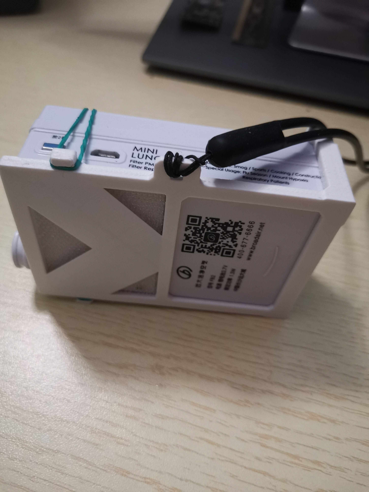
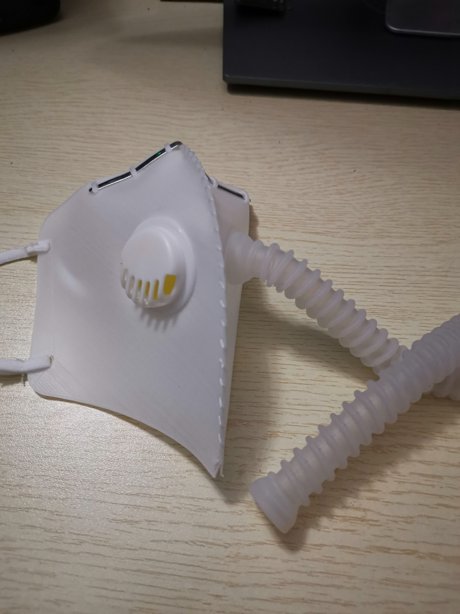
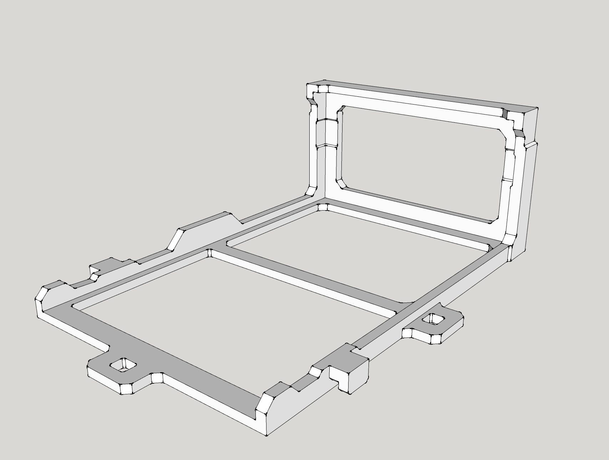
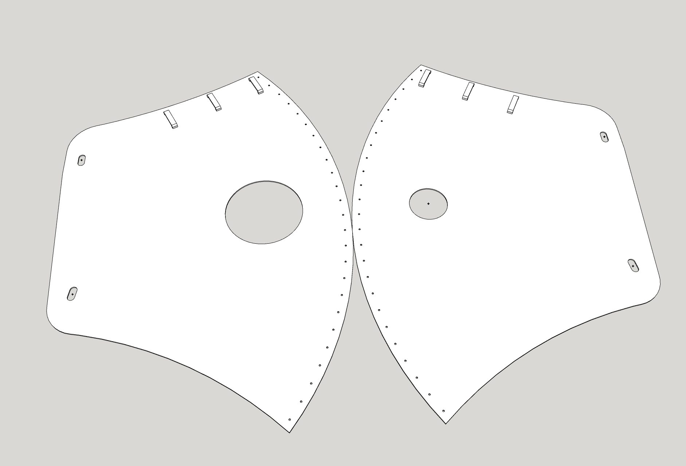

### 1. 介绍
适配远大移动肺宝，用于解决魔力贴失效以及自带挂绳孔太小的问题。 
口罩全身可水洗，理论可以永久使用，戴上口罩不可剧烈运动。
 
 
模型采用SketchUp制作

### 2. 准备
1. 挂绳，推荐硅胶挂绳
2. TPE耗材和PLA耗材
3. 口罩呼吸阀 [链接](https://item.taobao.com/item.htm?spm=a1z09.2.0.0.67002e8d2oqbzw&id=616866882484&_u=e1qg6u55c4e8)
4. 口罩鼻梁铝条 [链接](https://detail.tmall.com/item.htm?id=615376514367&spm=a1z09.2.0.0.67002e8d2oqbzw&_u=e1qg6u55b18e&skuId=4336016233225)
5. 口罩带5mm [链接](https://item.taobao.com/item.htm?spm=a1z10.3-c-s.w4002-964184705.10.15f57da7HX3USd&id=525403163362)
6. 缝针和线 [链接](https://item.taobao.com/item.htm?spm=a1z09.12.0.0.11ca2e8do3ZrIA&id=542804857288&_u=e1qg6u550f49)
7. 热熔胶
8. 橡皮筋

### 3. 备注
1. 打印TPE材料需要近端挤出FDM打印机。
2. 如果打印TPE挤出不顺建议Z轴偏移0.1mm。
3. 打印TPE建议打印速度30mm/s，无需支撑。
4. 热熔胶用在口罩缝合处，只需一点点，不用可能会漏气。

 

****

 

你的支持，是我不断贡献的动力！ 
